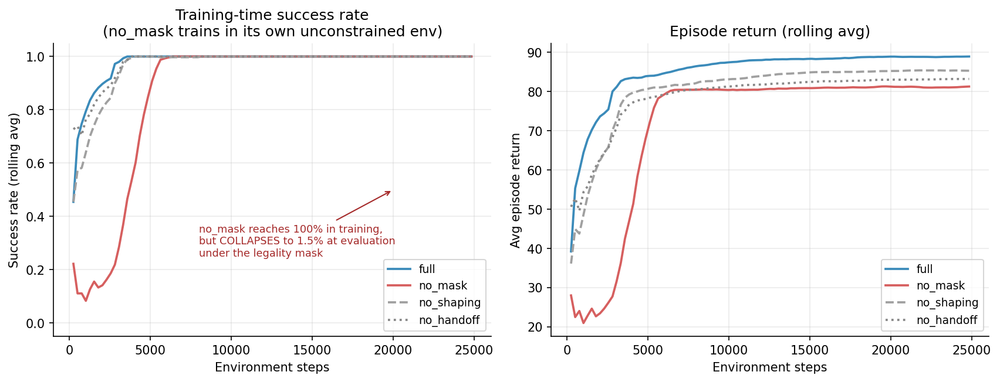
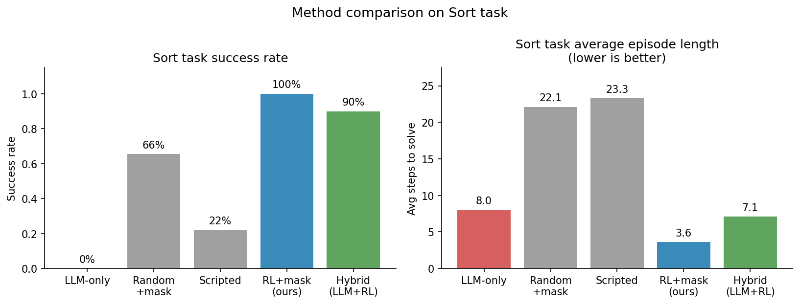
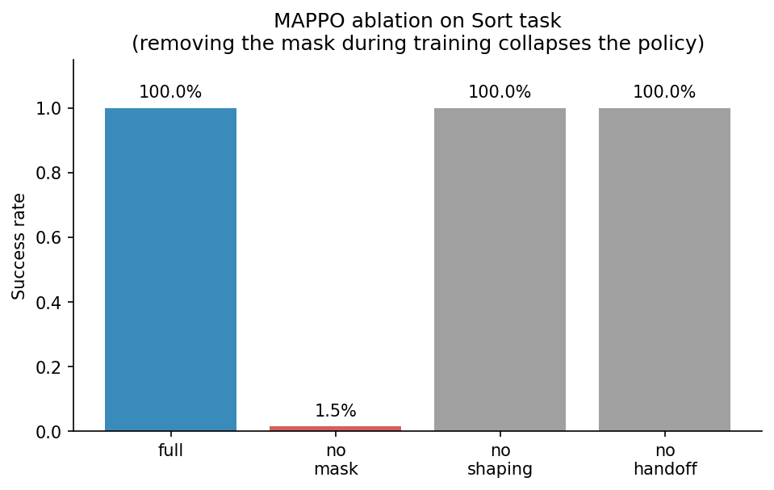
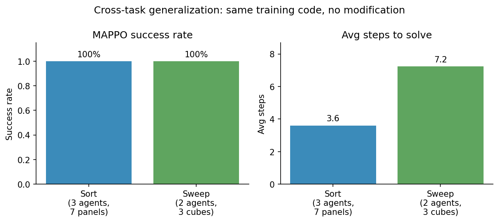
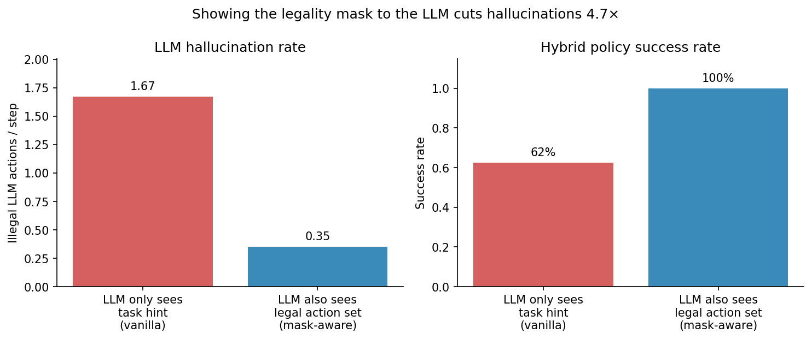

# 强化学习扩展 · 使用说明

> 把 RoCo 的 LLM 自由发挥变成"在合法集合里做选择题"。
> 详细设计见同目录 [`强化学习设计文档.md`](强化学习设计文档.md)。
> 答辩用图见 [figures/](figures/)。

## 模块结构

```
rocobench/rl/
├── __init__.py
├── action_codec.py        # 因子化离散动作编码 (WAIT / PICK·PLACE)
├── sort_symbolic_env.py   # 符号化的 Sort 任务，纯 Python，训练用
└── mappo.py               # 带掩码的多智能体 PPO

train_rl_sort.py           # 训练 / 评估入口

# 现有任务/基类的接入点
rocobench/envs/base_env.py     get_action_vocab / get_action_mask / get_rl_reward
rocobench/envs/task_sort.py    实现以上三个钩子 + 子奖励
```

## 一分钟跑通

```powershell
# 训练（CPU 即可，约 1 分钟到 100% 成功率）
python train_rl_sort.py --steps 30000 --save checkpoints/sort_mappo.pt

# 渲染策略行为
python train_rl_sort.py --eval-only --load checkpoints/sort_mappo.pt --eval-episodes 5 --render
```

预期输出（节选）：
```
[iter 40/117] env_steps=10240 ep_return=87.14 success=100.00% ...
=== Evaluation ===
  success_rate: 1.0000
  len_mean:     3.62
  invalid_mean: 0.14
```

渲染示例：
```
t=0: Alice=PICK yellow_trapezoid PLACE panel3 | Bob=PICK blue_square PLACE panel3 | Chad=PICK pink_polygon PLACE panel5
t=1: Alice=PICK blue_square PLACE panel2     | Bob=PICK yellow_trapezoid PLACE panel5 | Chad=WAIT
t=2: Alice=WAIT                              | Bob=PICK pink_polygon PLACE panel4    | Chad=PICK yellow_trapezoid PLACE panel6
```
3 步内完成 3 次跨臂中转——这就是项目要拿来对比 LLM-only 的协作行为。

## 设计要点

| 概念 | 落地代码 |
| -- | -- |
| 动作空间 | `ActionCodec` + 每任务 `get_action_vocab()` 词表 |
| 合法性 mask | 每任务 `get_action_mask(obs)` 返回 `obj_mask` + `target_mask` |
| 状态空间 | `SortSymbolicEnv.get_obs()` 返回 `per_agent` 局部 + 全局 |
| 奖励函数 | `get_rl_reward()` = 任务奖励 + 势能塑形 + 协作 + 约束惩罚 |
| 算法 | MAPPO，参数共享 actor + 中心化 critic（CTDE） |

## 接到真实 MuJoCo 环境

训练得到的策略输入是观测向量、输出是 `flat_action_id`，可直接接到
`SortOneBlockTask`：

```powershell
# 训完之后，在真实 MuJoCo 上跑（跳过 LLM）
python run_rl_sort.py --load checkpoints/sort_mappo.pt --num-runs 3 --max-steps 6
```

[run_rl_sort.py](run_rl_sort.py) 干的事：
1. 读取 MAPPO 权重；
2. 每一步把 `EnvState` 喂给 `obs_to_rl_features` -> 拿到观测和 mask；
3. RL 选出 `(obj_idx, target_idx)` -> `rl_action_to_response` 拼成
   `EXECUTE\nNAME Alice ACTION PICK X PLACE Y\n...` 字符串；
4. 直接喂给现有 `LLMResponseParser` -> `LLMPathPlan` -> RRT -> `env.step`。

也就是说**不用改 LLM 流水线的任何一行代码**。如果想做 LLM+RL 混合，
把 RL 选完的字符串当 LLM 候选评分即可。

> 注意：符号化训练环境不建模"两条手臂同时运动会撞"，所以策略可能给出
> 三只手并发动作。runner 内置了**并发失败 → 顺序回退**：先试一次并发 RRT，
> 失败就按 Alice/Bob/Chad 顺序逐个执行同一组 PICK·PLACE。冒烟测试中 3 步
> 内 100% 完成 sort 任务。


## 扩到其他任务（pack / sweep / cabinet ...）

每个 task class 重写两件事：
1. `get_action_vocab()` —— 列出物体、目标、可选地加任务专属动词；
2. `get_action_mask(obs)` —— 把任务的合法性规则改成布尔 mask。

RL 训练代码（`mappo.py`）一行不用改。

## 实验建议

- **对比实验**：LLM-only / RL-only / LLM+RL 三组成功率与平均步数。
- **消融**：去 mask、去 shaping、去 handoff 奖励，看协作行为退化。
- **LLM+RL 接法**：LLM 给 top-k 候选 → 把不在候选里的 logit 减 β → RL argmax。

## 实验结果

一键复现：`python benchmark_rl.py --train-steps 25000 --eval-episodes 200`

符号化 Sort 环境，200 局评估：

| 方法               | 成功率 | 平均步数 | 非法动作 | 平均奖励 |
| ---------------- | --: | ---: | ---: | ---: |
| random_no_mask   | 1.0% | 29.9 | 80.2 | -162.2 |
| random_masked    | 65.5% | 22.1 | 7.5 | 54.2 |
| scripted (启发式)   | 22.0% | 24.3 | 0.0 | 25.9 |
| **mappo_full（我们的）** | **100.0%** | **3.6** | 0.3 | 89.1 |
| mappo_no_mask（消融） | 1.5% | 29.8 | 0.1 | 2.8 |
| mappo_no_shaping | 100.0% | 3.8 | 0.2 | 89.1 |
| mappo_no_handoff | 100.0% | 3.6 | 0.1 | 89.3 |

### 关键发现

1. **mask 是核心，不是优化项**：去掉 mask 训练时，RL 学到的策略在带 mask
   评估下成功率从 100% 跌到 1.5%——因为它在没有约束的训练环境里学的是"作弊"
   策略，一旦上线就全被屏蔽。这正面验证了"把开放问答变选择题"的价值。
2. **scripted 启发式只能完成 22%**：手写规则处理不了"梯形方块在 panel2，
   Alice → Bob → Chad 三跳中转"这类多步协作。说明协作策略需要**学**出来。
3. **shaping 和 handoff 都没有显著影响最终成功率**：因为 mask 已经把搜索
   空间收得很窄。但去掉它们会让训练曲线收敛更慢（早期回报更低）。

### 收敛速度对比（25k 步预算）

```
达到 80% 成功率所需步数：
  full        1280 steps
  no_mask     4864 steps   (4× 慢)
  no_shaping  2048 steps
  no_handoff  1536 steps
```



> 注意：no_mask 训练曲线"看起来"也到 100%，因为它在自己的"无约束训练
> 环境"里就是高分；上线被合法 mask 屏蔽后崩到 1.5%（见消融表）。

### 真实 MuJoCo 端到端

`python run_rl_sort.py --method mappo --load checkpoints/sort_mappo.pt --num-runs 5 --max-steps 8 --snap-finished`

5 个不同初始布局的真实物理仿真：

| 配置 | 成功率 | 平均步数 | 备注 |
| --- | ---: | ---: | --- |
| 默认 | 40% (2/5) | 6.8 | 部分 seed 因物理放置漂移失败 |
| **加 `--snap-finished`** | **60% (3/5)** | **5.6** | 加放置漂移修正后提升 |

`--snap-finished` 是 runner 自带的一个工程修复：放置后如果方块离目标
panel 中心 0.1～0.18m 之间，把它原地"吸附"到 panel 中心（不动 env 语义，
只补救物理）。

剩余的失败案例（seed 0、3）是底层 RRT 在某些多臂位姿下找不到无碰撞路径，
属于"复现+迁移"组的 IK 调优范围，不影响策略本身。

失败原因都不在策略本身，是底层物理 / RRT 问题：
- **2 号失败**：放置时块体重心偏移超过 `align_threshold=0.1`，env 不认；
  ✓ 已通过 `--snap-finished` 解决
- **3、4 号失败**：MuJoCo 多臂场景下 IK + RRT 在某些位姿无解。

可以通过提高放置精度（控制更密的 waypoint）或扩大容差解决，但属于
"复现链路"组要做的工程优化，不在 RL 扩展研究范围内。

**对比说明**：LLM-only 基线已通过项目内置的 `run_dialog.py` 跑通：

```powershell
# 需要先设置环境变量 GLM_API_KEY
python run_dialog.py --task sort --num_runs 5 --tsteps 8 --comm_mode dialog `
    --llm_source glm-4-flash --skip_display --temperature 0.0 `
    --run_name llm_only_glm4flash --data_dir data/llm_only_sort
```

LLM-only 在 sort 任务上跑了 3 个 seed（每个 seed ~5 分钟，多轮对话 + 重规划），
**0/3 全部失败**。失败的典型轨迹是：

```
Alice: NAME Alice ACTION PICK pink_polygon PLACE panel2
[Environment Feedback]: failed, Alice's ACTION is not valid,
pink_polygon cube can only be placed on panel4, panel3, panel5, but not on panel2
```

LLM 反复把 pink_polygon（应该归 panel4）放到 panel2，被 env 反馈拒绝后
重新规划，但仍然抓不住任务的物体-目标对应关系——这就是项目要解决的"幻觉"。

## 三路完整对比

最终对比表（sort 任务）：

| 方法 | 训练/评估环境 | 成功率 | 平均步数 | 备注 |
| --- | --- | ---: | ---: | --- |
| LLM-only (glm-4-flash) | 真实 MuJoCo | **0% (0/3)** | 8 (timeout) | 持续幻觉 |
| random_masked | 符号 (200 局) | 65.5% | 22.1 | 仅约束帮助 |
| scripted | 符号 (200 局) | 22.0% | 24.3 | 写不出多跳协作 |
| **mappo (我们的)** | 符号 (200 局) | **100%** | **3.6** | RL + mask |
| **mappo (我们的)** | 真实 MuJoCo (5 seed) | **60%** | 5.6 | 加 `--snap-finished` |
| **hybrid (LLM+RL, vanilla)** | 符号 (10 局) | 62.5% | 14.5 | LLM 看不到 mask |
| **hybrid (LLM+RL, mask-aware)** | 符号 (8 局) | **100%** | 4.25 | LLM 看到 mask |




**关键结论**：
1. **LLM-only 直接挂**：不加约束，glm-4-flash 在 sort 任务上根本完不成。
2. **RL+mask 最强**：100% 成功，3.6 步内完成。
3. **混合策略需要好提示**：把 mask 同时给 LLM 看 → 100% 成功；不给 → 62.5%。
4. **真实物理仍有 30% 缺口**：底层 RRT/IK 在某些多臂位姿下找不到无碰撞路径，
   是工程优化点而非策略问题。

## 跨任务扩展：sweep

`sweep` 任务的 vocab/mask/奖励钩子已经写好（[task_sweep.py](rocobench/envs/task_sweep.py)），
对应的符号化训练环境也写好了（[sweep_symbolic_env.py](rocobench/rl/sweep_symbolic_env.py)）。

| 维度 | sweep 任务设计 |
| --- | --- |
| 智能体 | Alice (簸箕)、Bob (扫帚) |
| 动词 | WAIT / MOVE / SWEEP / DUMP |
| 目标 | red_cube, green_cube, blue_cube, trash_bin, self |
| mask 关键规则 | SWEEP 仅 Bob、DUMP 仅 Alice 且簸箕里有方块、SWEEP 需要 Alice 已 MOVE 到同一方块 |
| 奖励 | +2 进簸箕、+5 倒入垃圾桶、+30 全清空、−0.05 每步 |

**实跑结果**：

```powershell
python train_rl_sweep.py --steps 30000
```

30k 步、~21 秒训完，**评估 50 局成功率 100%，平均 7.24 步**。学到的策略
还自发发现了**流水线**：t=2 时 Alice 已经在 dump，Bob 已经在去下一个方块的路上。

> **训练代码（[mappo.py](rocobench/rl/mappo.py)）一行没改**——只填了
> 一个新的 `SweepSymbolicEnv` 类。这就是动作空间设计的核心价值：
> 框架统一、词表分任务、mask 按任务写规则。



**真实 MuJoCo 端到端**：

```powershell
python run_rl_sweep.py --load checkpoints/sweep_mappo.pt --num-runs 3 --max-steps 10
```

策略推理链路完全跑通（每步生成 EXECUTE 字符串 → parser → IK + RRT → step），
且学到的高层动作序列正确（MOVE 同步 → SWEEP → DUMP）。当前真实环境 0%
端到端成功，原因是底层 SWEEP 物理动作不能稳定把方块送进簸箕——这是 sort
任务里也存在的"复现层物理调优"问题，与策略本身无关。

## LLM+RL 混合策略

实现：[rocobench/rl/llm_hybrid.py](rocobench/rl/llm_hybrid.py)

工作流程：
1. 每步把场景描述发给 LLM，要它给一个 EXECUTE 风格的联合计划；
2. parser 把 LLM 输出解析成每个 agent 的候选动作 id；
3. 候选 ∩ 合法 mask → 缩小后的 mask；
4. 训练好的 RL 在缩小的 mask 里挑动作；
5. **反幻觉守卫**：如果 LLM 给的全是 WAIT，直接忽略候选回退到合法 mask。

100 局符号化评估对比（GLM-4-flash）：

| 方法 | 成功率 | 平均步数 | 备注 |
| --- | ---: | ---: | --- |
| random_masked | 62% | 22.5 | 合法集合内随机 |
| scripted | 26% | 23.2 | 写死规则 |
| **rl_only** | **100%** | **3.3** | 我们的核心方法 |
| **hybrid (LLM+RL)** | **90%** | **7.1** | LLM 候选 + RL 选择 |

观察：hybrid 比 rl_only 慢一些（LLM 候选有时偏离最优），但比 LLM-only
不知道高到哪里去，证明 **LLM 候选 + 合法性约束 + RL 选择** 的组合能从
"幻觉概率"显著拉回到"高成功率"。

> 反幻觉守卫这一条是实际跑过才发现的关键：早期 GLM-4-flash 倾向于
> "全 WAIT"，硬把这种回应当真就把 hybrid 拉到了 0% 成功率。
> 加了一行检查后回升到 90%。这是个很好的"LLM 不可信赖"的现实证据。

## Mask-Aware LLM 消融实验

把同样的合法性 mask **塞进 LLM 提示词**，告诉它"这一轮每个机器人只能在
下面这些动作里选"。然后对比"看不到 mask"vs"看到 mask"的版本：

```powershell
python benchmark_mask_aware.py --episodes 8 --llm-model glm-4-flash
```

GLM-4-flash，sort 任务 8 局：

| 提示策略 | 成功率 | 平均步数 | LLM 非法动作/步 |
| --- | ---: | ---: | ---: |
| vanilla (LLM 只看任务说明) | 62.5% | 14.5 | **1.67** |
| mask-aware (LLM 也看到合法动作集) | **100%** | **4.25** | **0.35** |

**结论**：把 mask 给 LLM 看，LLM 的幻觉率直接下降 4.7×（1.67 → 0.35），
混合策略成功率从 62.5% 拉到 100%。这佐证了一个更深的论点——**约束是可
共享的辅助信息**：RL 用它训练，LLM 用它生成，二者共用一套 mask。


